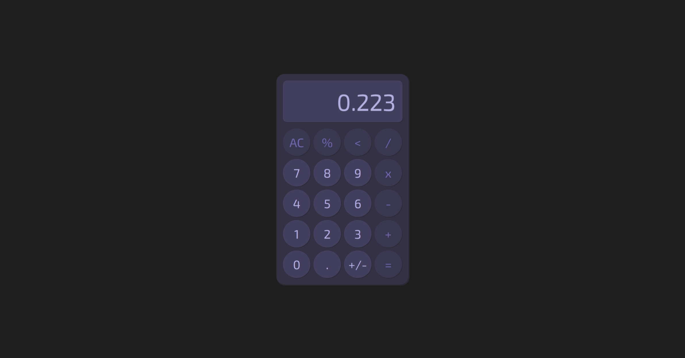

# The Odin Project - Etch a Sketch Solution 

This is a solution to the [calculator challenge on The Odin Project](https://www.theodinproject.com/lessons/foundations-calculator). The Odin Project is a free open-source coding curriculum that provides a comprehensive study path for aspiring developers. 

## Table of contents

- [Overview](#overview)
  - [Screenshot](#screenshot)
  - [Links](#links)
- [My process](#my-process)
  - [Built with](#built-with)
  - [What I learned](#what-i-learned)
  - [Continued development](#continued-development)
- [Author](#author)

## Overview

### The challenge

Create an on-screen calculator using JavaScript, HTML, and CSS. 

### Screenshot

#### Final Screenshot

### Links

- Solution URL: [https://github.com/colleennicole223/odin-calculator](https://github.com/colleennicole223/odin-calculator)
- Live Site URL: [https://colleennicole223.github.io/odin-calculator/](https://colleennicole223.github.io/odin-calculator/)

## My process

### Built with

- Figma (wireframe)
- HTML
- CSS
  - Flex Containers 
  - Custom Properties 
- JavaScript 
  - DOM Manipulation
    - Event Listeners to update user input onto the display

### What I learned

- can update string to float using parseFloat()

### Continued development

I have a lot of different 'if else' functions in my event listener, I would like to come back and make this cleaner once I learn of a good strategy to do so

## Author

- Personal Website - [Colleen Nicole](https://www.colleennicole.com)
- Odin Website - [The Odin Project](https://www.theodinproject.com)
- Frontend Mentor Profile - [@colleennicole223](https://www.frontendmentor.io/profile/colleennicole223)

